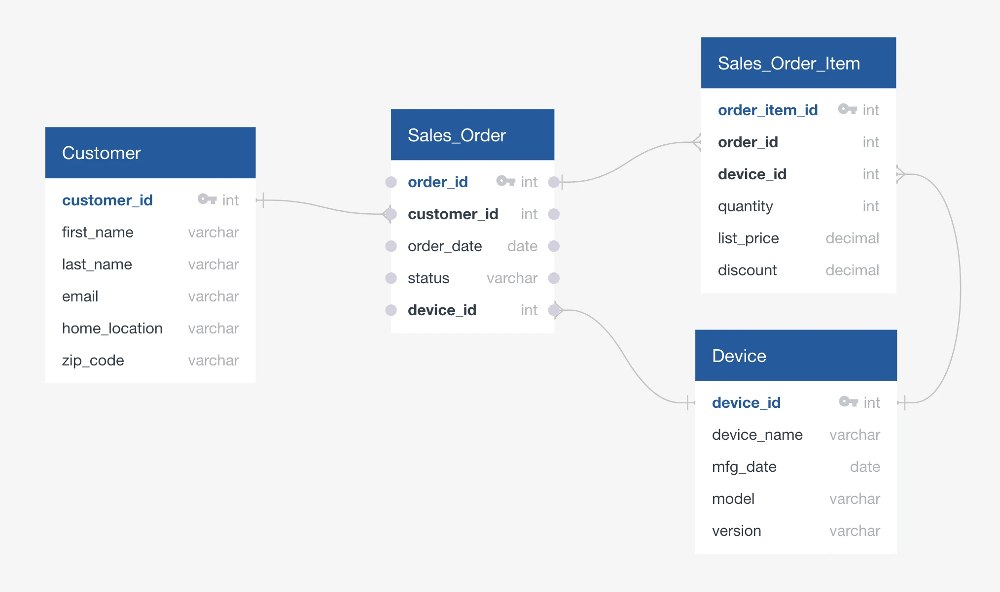

# OrdersDB Data Model

## Overview

The OrdersDB data model is a comprehensive e-commerce and sales data model designed for Snowflake demonstrations. It includes a complete order management system with customers, products, orders, and order items, along with advanced features like external stage integration, schema inference, and data governance.

## Entity Relationship Diagram



## Features

### Core Data Model
- **Customers Table**: Stores customer information including personal details and contact information
- **Devices/Products Table**: Stores product information including specifications and pricing
- **Sales Order Table**: Stores order header information including customer, dates, and totals
- **Sales Order Item Table**: Stores order line items including products, quantities, and pricing

### Advanced Features
- **External Stage Integration**: S3 bucket integration for data loading
- **Schema Inference**: Automatic table creation from external data
- **File Format Configuration**: CSV data handling with flexible parsing
- **PII Tagging**: Personally Identifiable Information (PII) tags for data governance
- **Product Tagging**: Product classification tags for better organization
- **Views**: Pre-built views for common analytics queries
- **Stored Procedures**: Business logic for customer and product analysis
- **Sample Data**: Realistic sample data for testing and demonstration

## Database Structure

```
OrdersDB
└── sales (schema)
    ├── customers
    ├── devices
    ├── sales_order
    ├── sales_order_item
    ├── customer_order_summary (view)
    ├── product_performance (view)
    ├── order_details (view)
    ├── GetTopCustomers() (stored procedure)
    └── GetProductSalesByCategory() (stored procedure)
```

## Tables

### customers
- **customer_id** (INT, Primary Key): Unique customer identifier
- **first_name** (VARCHAR(50)): Customer's first name
- **last_name** (VARCHAR(50)): Customer's last name
- **email** (VARCHAR(100)): Customer email address
- **phone** (VARCHAR(20)): Customer phone number
- **address** (VARCHAR(200)): Customer's address
- **city** (VARCHAR(50)): Customer's city
- **state** (VARCHAR(2)): Customer's state
- **zip_code** (VARCHAR(10)): Customer's zip code
- **country** (VARCHAR(50)): Customer's country
- **registration_date** (DATE): Customer registration date
- **load_date** (TIMESTAMP_LTZ): Record creation timestamp

### devices
- **device_id** (INT, Primary Key): Unique product identifier
- **device_name** (VARCHAR(100)): Product name
- **device_type** (VARCHAR(50)): Product type
- **manufacturer** (VARCHAR(100)): Product manufacturer
- **model** (VARCHAR(100)): Product model
- **price** (DECIMAL(10,2)): Product retail price
- **category** (VARCHAR(50)): Product category
- **description** (TEXT): Product description
- **load_date** (TIMESTAMP_LTZ): Record creation timestamp

### sales_order
- **order_id** (INT, Primary Key): Unique order identifier
- **customer_id** (INT, Foreign Key): Reference to customers table
- **order_date** (DATE): Order date
- **order_status** (VARCHAR(20)): Current status of the order
- **total_amount** (DECIMAL(10,2)): Order total amount
- **shipping_address** (VARCHAR(200)): Shipping address
- **shipping_city** (VARCHAR(50)): Shipping city
- **shipping_state** (VARCHAR(2)): Shipping state
- **shipping_zip** (VARCHAR(10)): Shipping zip code
- **payment_method** (VARCHAR(50)): Payment method used
- **load_date** (TIMESTAMP_LTZ): Record creation timestamp

### sales_order_item
- **order_item_id** (INT, Primary Key): Unique order item identifier
- **order_id** (INT, Foreign Key): Reference to sales_order table
- **device_id** (INT, Foreign Key): Reference to devices table
- **quantity** (INT): Number of units ordered
- **unit_price** (DECIMAL(10,2)): Unit price
- **total_price** (DECIMAL(10,2)): Total price for this item
- **discount_percent** (DECIMAL(5,2)): Discount percentage
- **load_date** (TIMESTAMP_LTZ): Record creation timestamp

## Views

### customer_order_summary
Provides a comprehensive summary of customer order performance including:
- Total orders per customer
- Total spent and average order value
- Last order date

### product_performance
Shows product performance analysis including:
- Times ordered and total quantity sold
- Total revenue and average unit price
- Product categorization

### order_details
Provides detailed order information including:
- Customer and order details
- Ordered products list
- Payment and shipping information

## Stored Procedures

### GetTopCustomers(limit_count INT)
Returns top customers by revenue, including:
- Customer details
- Total spent
- Order count

### GetProductSalesByCategory()
Returns product sales analysis by category, including:
- Category breakdown
- Total revenue and quantity
- Product count per category

## Data Governance

### PII Tags
The following columns are tagged for Personally Identifiable Information:
- **email**: Tagged as EMAIL
- **phone**: Tagged as PHONE
- **first_name**: Tagged as FIRST_NAME
- **last_name**: Tagged as LAST_NAME

### Product Tags
- **device_name**: Tagged as DEVICE_NAME
- **category**: Tagged as CATEGORY

## External Data Integration

### File Format
- **CSV_SCHEMA_DETECTION**: Configured for CSV data with header parsing
- Supports flexible column count and blank line handling

### Stage Configuration
- **DEMOHUB_S3_INT**: External stage pointing to S3 bucket
- Directory listing enabled for data discovery

### Schema Inference
- Automatic table creation from external data structure
- Template-based approach for consistent data loading

## Sample Data

The model includes realistic sample data for:
- 5 customers with complete information
- 5 products across different categories
- 5 orders with various statuses
- 5 order items with pricing information

## Usage Examples

### Basic Customer Query
```sql
SELECT * FROM sales.customer_order_summary
ORDER BY total_spent DESC;
```

### Product Performance Analysis
```sql
SELECT * FROM sales.product_performance
WHERE total_revenue > 0
ORDER BY total_revenue DESC;
```

### Using Stored Procedures
```sql
-- Get top customers
CALL GetTopCustomers(5);

-- Get product sales by category
CALL GetProductSalesByCategory();
```

## Setup Instructions

1. Run the complete `ordersdb_data_model.sql` script in Snowflake
2. The script will create:
   - Database and schema
   - All tables with relationships
   - External stage and file format
   - Schema inference tables
   - Sample data
   - Tags for data governance
   - Stored procedures and views
   - Appropriate permissions

## Cleanup

To reset the demo environment, uncomment and run the cleanup section at the end of the SQL script.

## Version History

- **Version 1.2.7** (05/26/2024): Complete data model with external stage integration
- Based on DemoHub OrdersDB Data Model

## Related Resources

- DemoHub OrdersDB Data Model: https://complex-teammates-374480.framer.app/demo/ordersdb-data-model 