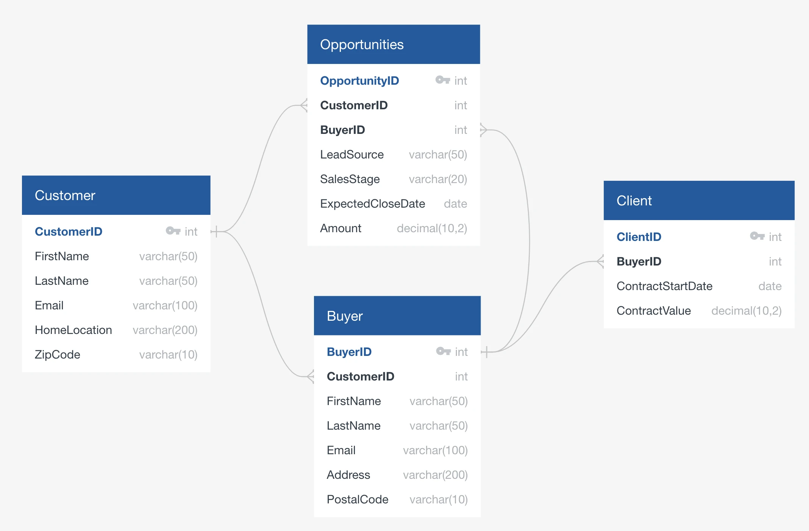

# SalesDB Data Model

## Overview

The SalesDB data model is a comprehensive sales data model designed for Snowflake demonstrations and learning purposes. It includes a complete sales pipeline with customers, buyers, clients, and opportunities, along with advanced features like role-based access control, data tagging, stored procedures, and views.

## Entity Relationship Diagram



## Features

### Core Data Model
- **Customer Table**: Stores customer information including personal details and contact information
- **Buyer Table**: Stores buyer information linked to customers
- **Client Table**: Stores client contract information linked to buyers
- **Opportunities Table**: Stores sales opportunities and pipeline information

### Advanced Features
- **PII Tagging**: Personally Identifiable Information (PII) tags for data governance
- **Role-Based Access Control (RBAC)**: Different access levels for SalesRep and SalesManager roles
- **Stored Procedures**: Business logic for high-value customers and closing opportunities
- **Views**: Pre-built views for common sales analytics queries
- **Sample Data**: Realistic sample data for testing and demonstration
- **Comments**: Comprehensive documentation on tables and columns

## Database Structure

```
SalesDB
└── custs (schema)
    ├── Customer
    ├── Buyer
    ├── Client
    ├── Opportunities
    ├── CustomerSalesSummary (view)
    ├── SalesPipelineByStage (view)
    ├── GetHighValueCustomers() (stored procedure)
    └── GetClosingOpportunities() (stored procedure)
```

## Tables

### Customer
- **CustomerID** (INT, Primary Key): Unique customer identifier
- **FirstName** (VARCHAR(50)): Customer's first name
- **LastName** (VARCHAR(50)): Customer's last name
- **VarNumber** (VARCHAR(20)): Vendor number for partner identification
- **Email** (VARCHAR(100)): Customer email address
- **HomeLocation** (VARCHAR(200)): Customer's location
- **ZipCode** (VARCHAR(10)): Customer's zip code
- **LoadDate** (TIMESTAMP_LTZ): Record creation timestamp

### Buyer
- **BuyerID** (INT, Primary Key): Unique buyer identifier
- **CustomerID** (INT, Foreign Key): Reference to Customer table
- **FirstName** (VARCHAR(50)): Buyer's first name
- **LastName** (VARCHAR(50)): Buyer's last name
- **Email** (VARCHAR(100)): Buyer email address
- **Address** (VARCHAR(200)): Buyer's address
- **PostalCode** (VARCHAR(10)): Buyer's postal code
- **LoadDate** (TIMESTAMP_LTZ): Record creation timestamp

### Client
- **ClientID** (INT, Primary Key): Unique client identifier
- **BuyerID** (INT, Foreign Key): Reference to Buyer table
- **ContractStartDate** (DATE): Contract start date
- **ContractValue** (DECIMAL(10,2)): Contract monetary value
- **LoadDate** (TIMESTAMP_LTZ): Record creation timestamp

### Opportunities
- **OpportunityID** (INT, Primary Key): Unique opportunity identifier
- **CustomerID** (INT, Foreign Key): Reference to Customer table
- **BuyerID** (INT, Foreign Key): Reference to Buyer table
- **LeadSource** (VARCHAR(50)): Source of the sales lead
- **SalesStage** (VARCHAR(20)): Current stage in sales pipeline
- **ExpectedCloseDate** (DATE): Expected close date
- **Amount** (DECIMAL(10,2)): Expected or actual deal value
- **LoadDate** (TIMESTAMP_LTZ): Record creation timestamp

## Views

### CustomerSalesSummary
Provides a comprehensive summary of customer sales performance including:
- Total opportunities per customer
- Won vs pipeline amounts
- Last expected close date

### SalesPipelineByStage
Shows sales pipeline analysis by stage including:
- Opportunity count and total amount per stage
- Average deal size per stage
- Date ranges for closing

## Stored Procedures

### GetHighValueCustomers()
Returns customers with total won opportunity value > $50,000, including:
- Customer details
- Total value
- Opportunity count

### GetClosingOpportunities()
Returns opportunities likely to close within the next month, including:
- Opportunity details
- Days to close
- Customer information

## Roles and Permissions

### SalesRep Role
- Basic access to customer data
- Access to CustomerSalesSummary view
- Limited table access

### SalesManager Role
- Full access to all tables in the schema
- Access to all views and stored procedures
- Enhanced permissions for management tasks

## Data Governance

### PII Tags
The following columns are tagged for Personally Identifiable Information:
- **Email**: Tagged as EMAIL
- **FirstName**: Tagged as FIRST_NAME
- **LastName**: Tagged as LAST_NAME
- **VarNumber**: Tagged as VENDOR_ID

### Lead Source Tags
- **LeadSource**: Tagged for lead source tracking

## Sample Data

The model includes realistic sample data for:
- 10 customers with complete information
- 10 buyers linked to customers
- 10 clients with contract information
- 10 opportunities across different sales stages

## Usage Examples

### Basic Customer Query
```sql
SELECT 
    c.CustomerID,
    c.FirstName || ' ' || c.LastName as CustomerName,
    SUM(o.Amount) as TotalOpportunityValue
FROM Customer c
LEFT JOIN Opportunities o ON c.CustomerID = o.CustomerID
GROUP BY c.CustomerID, c.FirstName, c.LastName
ORDER BY TotalOpportunityValue DESC;
```

### Sales Pipeline Analysis
```sql
SELECT 
    SalesStage,
    COUNT(*) as Count,
    SUM(Amount) as TotalValue
FROM Opportunities
GROUP BY SalesStage
ORDER BY 
    CASE SalesStage
        WHEN 'Prospecting' THEN 1
        WHEN 'Qualification' THEN 2
        WHEN 'Proposal' THEN 3
        WHEN 'Negotiation' THEN 4
        WHEN 'Closed Won' THEN 5
        WHEN 'Closed Lost' THEN 6
        ELSE 7
    END;
```

### Using Stored Procedures
```sql
-- Get high-value customers
CALL GetHighValueCustomers();

-- Get opportunities closing soon
CALL GetClosingOpportunities();
```

## Setup Instructions

1. Run the complete `salesdb_data_model.sql` script in Snowflake
2. The script will create:
   - Database and schema
   - All tables with relationships
   - Sample data
   - Tags for data governance
   - Stored procedures and views
   - Roles and users
   - Appropriate permissions

## Cleanup

To reset the demo environment, uncomment and run the cleanup section at the end of the SQL script.

## Version History

- **Version 1.2.7** (05/23/2024): Complete data model with RBAC, stored procedures, and views
- Based on DemoHub SalesDB Data Model

## Related Resources

- DemoHub SalesDB Data Model: https://complex-teammates-374480.framer.app/demo/salesdb-data-model
- Snowflake Copilot Integration: https://complex-teammates-374480.framer.app/demo/snowflake-co-pilot 