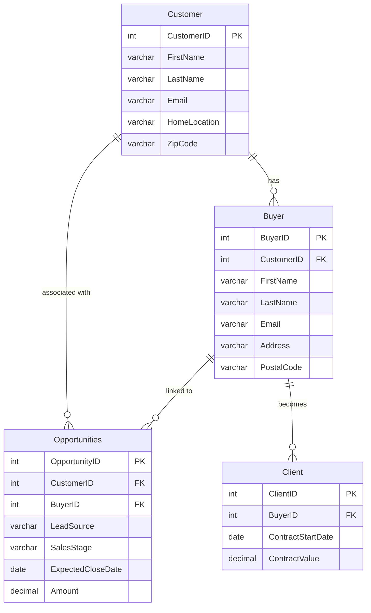

# SalesDB

The provided SalesDB data model includes four tables: Customer, Buyer, Client, and Opportunities. It incorporates comments and tags to enhance search capabilities and security. Additionally, functions, stored procedures, and views are provided to demonstrate how Universal Search can be used for deeper analysis.

## Table of Contents

This page contains the following sections:

## Step-by-Step Implementation

<details open>
<summary>Click to collapse step-by-step implementation</summary>

### Database Entity Relationship Diagram



_DemoHub - SalesDB Data Model - Version 1.2.7 (updated 05/23/2024)_

```sql title="SalesDB Demo Script Header"
/*
------------------------------------------------------------------------------
-- Snowflake Demo Script: Sales Data Model and Universal Search Exploration
-- 
-- Description: 
-- This script sets up a sales data model in Snowflakes. It includes the creation of tables for customers, buyers,
-- clients, and opportunities, along with sample data insertion and tagging of 
-- columns for PII, lead source, and sales stage. Additionally, it defines RBAC 
-- privileges, functions, stored procedures, and views for analysis purposes.
--
-- Author: Fru N.
-- Website: DemoHub.dev
--
-- Date: May 15, 2024
--
-- Copyright: (c) 2024 DemoHub.dev. All rights reserved.
--
-- Disclaimer:  
-- This script is for educational and demonstration purposes only. It is not
-- affiliated with or endorsed by Snowflake Computing. Use this code at your 
-- own risk.
------------------------------------------------------------------------------
*/
```

### 1. DATABASE AND SCHEMA SETUP

```sql title="Database and Schema Setup" linenums="1"
-- +----------------------------------------------------+
-- |             1. DATABASE AND SCHEMA SETUP             |
-- +----------------------------------------------------+

-- Creates a new database named "SalesDB".
CREATE OR REPLACE DATABASE SalesDB;

-- Use the newly created database.
USE SalesDB;

-- Create a schema within the database.
CREATE OR REPLACE SCHEMA customer;
```

### 2. CREATE TABLE OBJECTS

```sql title="Create Database Tables" linenums="10"
-- +----------------------------------------------------+
-- |             2. CREATE TABLE OBJECTS             |
-- +----------------------------------------------------+

-- Create tables for storing customer, buyer, client, and opportunity data.

-- Customer Table
CREATE OR REPLACE TABLE Customer (
    CustomerID INT PRIMARY KEY,
    FirstName VARCHAR(50),
    LastName VARCHAR(50),
    VarNumber VARCHAR(20),
    Email VARCHAR(100),
    HomeLocation VARCHAR(200),
    ZipCode VARCHAR(10),
    LoadDate TIMESTAMP_LTZ DEFAULT CURRENT_TIMESTAMP()  
);

-- Buyer Table
CREATE OR REPLACE TABLE Buyer (
    BuyerID INT PRIMARY KEY,
    CustomerID INT REFERENCES Customer(CustomerID),
    FirstName VARCHAR(50),
    LastName VARCHAR(50),
    Email VARCHAR(100),
    Address VARCHAR(200),
    PostalCode VARCHAR(10),
    LoadDate TIMESTAMP_LTZ DEFAULT CURRENT_TIMESTAMP()  
);

-- Client Table
CREATE OR REPLACE TABLE Client (
    ClientID INT PRIMARY KEY,
    BuyerID INT REFERENCES Buyer(BuyerID),
    ContractStartDate DATE,
    ContractValue DECIMAL(10, 2),
    LoadDate TIMESTAMP_LTZ DEFAULT CURRENT_TIMESTAMP()  
);

-- Opportunities Table
CREATE OR REPLACE TABLE Opportunities (
    OpportunityID INT PRIMARY KEY,
    CustomerID INT REFERENCES Customer(CustomerID),
    BuyerID INT REFERENCES Buyer(BuyerID),
    LeadSource VARCHAR(50),
    SalesStage VARCHAR(20),
    ExpectedCloseDate DATE,
    Amount DECIMAL(10, 2),
    LoadDate TIMESTAMP_LTZ DEFAULT CURRENT_TIMESTAMP()  
);
```

### 3. INSERT SAMPLE DATA

```sql title="Insert Sample Data with Quality Issues" linenums="106"
-- +----------------------------------------------------+
-- |             3. INSERT SAMPLE DATA             |
-- +----------------------------------------------------+

-- Insert sample data into the created tables.

-- Customer Data Insertion
INSERT INTO Customer (CustomerID, FirstName, LastName, Email, HomeLocation, ZipCode, VarNumber, LoadDate)
VALUES
    (1, 'Alice', 'Johnson', 'alice.johnson@example.com', '123 Oak St', '94105', 'LTY-12345', '2024-04-20 10:30:00'),  -- Valid
    (2, 'Bob', 'Smith', 'bob.smith@example.com', '456 Elm St', '10001', 'LTY-23456', '2024-03-15 11:15:00'),        -- Valid
    (3, 'Eva', 'Davies', 'eva.davis@example.com', '789 Maple Ave', '20001', 'LTY-34567', '2024-02-10 14:45:00'),   -- Valid
    (4, 'Dave', 'Brown', 'dave.brown@example.com', '123 Main St', '54321', 'LTY-45678', '2023-12-30 09:20:00'),   -- Stale Data
    (5, 'Emily', 'White', 'invalid_email', '456 Park Ave', '67890', 'LTY-56789', '2024-05-15 16:55:00'),        -- Invalid Email
    (6, NULL, 'Wilson', 'charlie.wilson@example.com', '789 Broadway', '87654', 'LTY-67890', '2024-05-18 12:00:00'), -- Missing First Name
    (7, 'Grace', 'Lee', 'grace.lee@example.com', NULL, '34567', 'LTY-78901', '2024-05-10 08:50:00'),         -- Missing HomeLocation
    (8, 'Henry', 'Miller', 'henry.miller@example.com', '1011 Market St', '', 'LTY-89012', '2024-05-05 15:35:00'),  -- Missing ZipCode
    (9, 'Ivy', 'Tailor', 'alice.johnson@example.com', '5566 Sunset Blvd', '12345', 'LTY-90123', '2024-05-19 18:10:00'), -- Duplicate Email (same as Alice). Wrong spelling of tailor
    (10, 'Eva', 'Davis', 'eva.davis@anderson.com', '2233 River Rd', '98765', 'LTY-01234', '2024-05-01 13:25:00');   -- Valid


-- Buyer Data Insertion
INSERT INTO Buyer (BuyerID, CustomerID, FirstName, LastName, Email, Address, PostalCode, LoadDate)
VALUES
    (101, 1, 'Alice', 'Johnson', 'alice.johnson@example.com', '123 Oak St', '94105', '2024-04-25 12:30:00'),   -- Valid
    (102, 2, 'Bob', 'Smith', 'bob.smith@example.com', '456 Elm St', '10001', '2024-03-20 15:45:00'),      -- Valid
    (103, NULL, 'David', 'Lee', 'david.lee@example.com', '987 Pine St', '33101', '2024-02-15 11:20:00'),   -- Valid, No CustomerID
    (104, 4, 'Dave', 'Brown', 'dave.brown@example.com', '123 Main St', '54321', '2023-12-31 14:30:00'),   -- Stale Data
    (105, 5, 'Emily', 'White', 'invalid_email2', '456 Park Ave', '67890', '2024-05-16 10:15:00'),        -- Invalid Email
    (106, 6, NULL, 'Wilson', 'charlie.wilson@example.com', '789 Broadway', '87654', '2024-05-19 09:45:00'),-- Missing First Name
    (107, 7, 'Grace', 'Li', 'grace.lee@example.com', NULL, '34567', '2024-05-11 16:25:00'),            -- Missing Address
    (108, 8, 'Henry', 'Mila', 'henry.miller@example.com', '1011 Market St', '', '2024-05-06 13:00:00'),  -- Missing PostalCode. Wrong spelling of mller
    (109, 9, 'Ivy', 'Taylor', 'ivy.taylor@example.com', '5566 Sunset Blvd', '12345', '2024-05-20 17:50:00'), -- Duplicate Email (same as Alice)
    (110, 10, 'Jack', 'Anderson', 'jack.anderson@example.com', '2233 River Rd', '98765', '2024-05-02 14:15:00'); -- Valid


-- Client Data Insertion
INSERT INTO Client (ClientID, BuyerID, ContractStartDate, ContractValue, LoadDate)
VALUES
    (201, 101, '2024-01-15', 50000.00, '2024-04-25 12:30:00'),   -- Valid
    (202, 102, '2024-02-20', 75000.00, '2024-03-20 15:45:00'),   -- Valid
    (203, 103, '2024-03-10', 30000.00, '2024-02-15 11:20:00'),   -- Valid
    (204, 104, '2023-11-01', 100000.00, '2023-12-31 14:30:00'),  -- Stale Data
    (205, 105, '2024-05-01', 25000.00, '2024-05-16 10:15:00'),   -- Valid
    (206, 106, '2024-05-15', 40000.00, '2024-05-19 09:45:00'),   -- Valid
    (207, 107, '2024-04-01', 60000.00, '2024-05-11 16:25:00'),   -- Valid
    (208, 108, '2024-05-10', 35000.00, '2024-05-06 13:00:00'),   -- Valid
    (209, 109, '2024-05-20', 45000.00, '2024-05-20 17:50:00'),   -- Valid
    (210, 110, '2024-05-05', 55000.00, '2024-05-02 14:15:00');   -- Valid


-- Opportunities Data Insertion
INSERT INTO Opportunities (OpportunityID, CustomerID, BuyerID, LeadSource, SalesStage, ExpectedCloseDate, Amount, LoadDate)
VALUES
    (301, 1, 101, 'Web Form', 'Proposal', '2024-06-15', 25000.00, '2024-04-25 12:30:00'),   -- Valid
    (302, 2, 102, 'Partner Referral', 'Negotiation', '2024-06-30', 50000.00, '2024-03-20 15:45:00'),   -- Valid
    (303, 3, 103, 'Trade Show', 'Qualification', '2024-07-15', 30000.00, '2024-02-15 11:20:00'),   -- Valid
    (304, 4, 104, 'Outbound Call', 'Closed Won', '2024-01-30', 75000.00, '2023-12-31 14:30:00'),   -- Stale Data
    (305, 5, 105, 'Web Form', 'Prospecting', '2024-08-15', 20000.00, '2024-05-16 10:15:00'),   -- Valid
    (306, 6, 106, 'Partner Referral', 'Qualification', '2024-07-30', 35000.00, '2024-05-19 09:45:00'),   -- Valid
    (307, 7, 107, 'Trade Show', 'Proposal', '2024-06-20', 40000.00, '2024-05-11 16:25:00'),   -- Valid
    (308, 8, 108, 'Outbound Call', 'Negotiation', '2024-07-10', 30000.00, '2024-05-06 13:00:00'),   -- Valid
    (309, 9, 109, 'Web Form', 'Closed Lost', '2024-05-25', 25000.00, '2024-05-20 17:50:00'),   -- Valid
    (310, 10, 110, 'Partner Referral', 'Closed Won', '2024-06-05', 60000.00, '2024-05-02 14:15:00');   -- Valid
```

### 4. CREATE FUNCTIONS AND STORED PROCEDURES

```sql title="Create Functions and Stored Procedures" linenums="177"
-- +----------------------------------------------------+
-- |             4. CREATE FUNCTIONS AND STORED PROCEDURES             |
-- +----------------------------------------------------+

-- Function to calculate total closed won value for a customer
CREATE OR REPLACE FUNCTION customer_closed_won_value(customer_id INT)
RETURNS DECIMAL(10, 2)
LANGUAGE SQL
AS $$
    SELECT COALESCE(SUM(Amount), 0)
    FROM SalesDB.customer.Opportunities
    WHERE CustomerID = customer_id
    AND SalesStage = 'Closed Won'
$$;

-- Function to categorize customers based on their total value
CREATE OR REPLACE FUNCTION categorize_customer(customer_id INT)
RETURNS STRING
LANGUAGE SQL
AS $$
    SELECT CASE
        WHEN customer_closed_won_value(customer_id) >= 100000 THEN 'High Value'
        WHEN customer_closed_won_value(customer_id) >= 50000 THEN 'Medium Value'
        ELSE 'Low Value'
    END
$$;

-- Stored procedure to update opportunity stage
CREATE OR REPLACE PROCEDURE update_opportunity_stage (opportunity_id INT, new_stage VARCHAR)
RETURNS STRING
LANGUAGE SQL
AS $$
BEGIN
    UPDATE SalesDB.customer.Opportunities
    SET SalesStage = new_stage
    WHERE OpportunityID = opportunity_id;
    RETURN 'Success'; -- or any message you want to return upon successful execution
END;
$$;


-- Stored procedure to assign a new buyer to a customer
CREATE OR REPLACE PROCEDURE assign_buyer_to_customer (customer_id INT, buyer_id INT)
RETURNS STRING
LANGUAGE SQL
AS $$
BEGIN
    UPDATE SalesDB.customer.Customer
    SET BuyerID = buyer_id
    WHERE CustomerID = customer_id;
END;
$$;

-- View to display high-value customers
CREATE OR REPLACE VIEW high_value_customers AS
SELECT c.*, customer_closed_won_value(c.CustomerID) AS TotalValue
FROM Customer c;
--WHERE categorize_customer(c.CustomerID) = 'High Value';

-- View to display opportunities likely to close in the next month
CREATE OR REPLACE VIEW opportunities_likely_to_close AS
SELECT *
FROM Opportunities
WHERE SalesStage IN ('Negotiation', 'Proposal')
AND ExpectedCloseDate BETWEEN CURRENT_DATE AND DATEADD(month, 1, CURRENT_DATE);
```

### 5. CREATE TAGS AND APPLY

```sql title="Create and Apply Data Tags" linenums="247"
-- +----------------------------------------------------+
-- |             5. CREATE TAGS AND APPLY             |
-- +----------------------------------------------------+
-- -- Define tags for PII, lead source, and sales stage and apply them to relevant columns.

create or REPLACE tag cost_center
    allowed_values 'finance', 'engineering';

-- Create Tag for Personally Identifiable Information (PII)
CREATE or REPLACE TAG PII ALLOWED_VALUES 'Name', 'Email', 'Address' COMMENT = 'Indicates personally identifiable information';

-- Create Tag for Lead Source
CREATE or REPLACE TAG Lead_Source ALLOWED_VALUES 'Partner Referral', 'Web Form', 'Outbound Call', 'Trade Show' COMMENT = 'Indicates the source of the lead or opportunity';

-- Create Tag for Sales Stage
CREATE or REPLACE TAG Sales_Stage ALLOWED_VALUES 'Prospecting', 'Qualification', 'Proposal', 'Negotiation', 'Closed Won', 'Closed Lost' COMMENT = 'Indicates the current stage of the sales opportunity';

-- Apply Tags to Tables and Columns

-- Customer Table
ALTER TABLE Customer MODIFY COLUMN FirstName SET TAG PII = 'Name';
ALTER TABLE Customer MODIFY COLUMN LastName SET TAG PII = 'Name';
ALTER TABLE Customer MODIFY COLUMN Email SET TAG PII = 'Email';


-- Buyer Table
ALTER TABLE Buyer MODIFY COLUMN FirstName SET TAG PII = 'Name';
ALTER TABLE Buyer MODIFY COLUMN LastName SET TAG PII = 'Name';
ALTER TABLE Buyer MODIFY COLUMN Email SET TAG PII = 'Email';
ALTER TABLE Buyer MODIFY COLUMN Address SET TAG PII = 'Address';


-- Client Table: Should FAIL. Missing Column
ALTER TABLE Client MODIFY COLUMN Address SET TAG PII = 'Address';

-- Opportunities Table: Should FAIL. Invalid Tag Values. 
ALTER TABLE Opportunities MODIFY COLUMN LeadSource SET TAG Lead_Source = 'LeadSource';
ALTER TABLE Opportunities MODIFY COLUMN SalesStage SET TAG Sales_Stage = 'SalesStage';
```

### 6. CREATE MASKING AND APPLY TO TAGS/COLUMNS

```sql title="Create Data Masking Policies" linenums="292"
-- +----------------------------------------------------+
-- |             6. CREATE MASKING AND APPLY TO TAGS/COLUMNS          |
-- +----------------------------------------------------+
USE ROLE ACCOUNTADMIN;

-- Create a masking policy for PII data
CREATE OR REPLACE MASKING POLICY mask_pii AS (val string) RETURNS string ->
    CASE
        WHEN current_role() IN ('SalesManager') THEN val -- Full access for SalesManager
        ELSE '***MASKED***'   -- Mask for all other roles
    END;

-- Apply the masking policy to columns tagged with PII
ALTER TAG PII SET MASKING POLICY mask_pii;
-- ... (Apply to other PII columns in Buyer and Client tables)
```

### 7. RBAC PRIVILEGES SETUP

```sql title="Setup Role-Based Access Control" linenums="314"
-- +----------------------------------------------------+
-- |             7. RBAC PRIVILEGES SETUP               |
-- +----------------------------------------------------+

-- Define roles and grant privileges for role-based access control.

-- Use a role with sufficient privileges
USE ROLE ACCOUNTADMIN;

-- Create Roles
CREATE OR REPLACE ROLE SalesRep;
CREATE OR REPLACE ROLE SalesManager;

-- Grant Usage on Database to Roles
GRANT USAGE ON DATABASE SalesDB TO ROLE SalesRep;
GRANT USAGE ON DATABASE SalesDB TO ROLE SalesManager;

-- Grant Usage on Schema to Roles
GRANT USAGE ON SCHEMA SalesDB.customer TO ROLE SalesRep;
GRANT USAGE ON SCHEMA SalesDB.customer TO ROLE SalesManager;

-- Grant Usage on Warehouse to Roles
GRANT USAGE ON WAREHOUSE Demo_WH TO ROLE SalesRep;
GRANT USAGE ON WAREHOUSE Demo_WH TO ROLE SalesManager;

-- Grant Select on Tables to Roles
GRANT SELECT ON TABLE Customer TO ROLE SalesRep;
GRANT SELECT ON ALL TABLES IN SCHEMA customer TO ROLE SalesManager; -- More access
```

### 8. SWITCH TO THE ACCOUNTADMIN ROLE

```sql title="Switch to AccountAdmin Role" linenums="349"
-- +----------------------------------------------------+
-- |       8. SWITCH TO THE ACCOUNTADMIN ROLE           |
-- +----------------------------------------------------+

-- When Demoing or testing this; switch to the user called DEMO. 
-- Make sure to switch the role from default to SALES REP. Perform Search with universal search
USE ROLE ACCOUNTADMIN;

-- Grant the SalesRep role to the Fru user (Admin)
GRANT ROLE SalesManager TO USER Fru;

-- Grant the SalesRep role to the Demo user
GRANT ROLE SalesRep TO USER Demo;
```

### 9. RESET DEMO ENVIRONMENT

```sql title="Reset Demo Environment" linenums="367"
-- +----------------------------------------------------+
-- |             9. RESET DEMO ENVIRONMENT              |
-- +----------------------------------------------------+

USE ROLE ACCOUNTADMIN;  -- Or a role with sufficient privileges

-- Drop the database
DROP DATABASE IF EXISTS SalesDB CASCADE;

-- Revoke from user
REVOKE ROLE SalesRep FROM USER Demo;

-- Drop the roles
DROP ROLE IF EXISTS SalesRep;
DROP ROLE IF EXISTS SalesManager;
```

</details>

## Complete Code

<details>
<summary>Click to expand complete implementation</summary>

### Complete SalesDB Implementation

Copy and run this complete script to set up the entire SalesDB data model:

```sql
/*
------------------------------------------------------------------------------
-- Snowflake Demo Script: Sales Data Model and Universal Search Exploration
-- 
-- Description: 
-- This script sets up a sales data model in Snowflakes. It includes the creation of tables for customers, buyers,
-- clients, and opportunities, along with sample data insertion and tagging of 
-- columns for PII, lead source, and sales stage. Additionally, it defines RBAC 
-- privileges, functions, stored procedures, and views for analysis purposes.
--
-- Author: Fru N.
-- Website: DemoHub.dev
--
-- Date: May 15, 2024
--
-- Copyright: (c) 2024 DemoHub.dev. All rights reserved.
--
-- Disclaimer:  
-- This script is for educational and demonstration purposes only. It is not
-- affiliated with or endorsed by Snowflake Computing. Use this code at your 
-- own risk.
------------------------------------------------------------------------------
*/

-- +----------------------------------------------------+
-- |             1. DATABASE AND SCHEMA SETUP             |
-- +----------------------------------------------------+

-- Creates a new database named "SalesDB".
CREATE OR REPLACE DATABASE SalesDB;

-- Use the newly created database.
USE SalesDB;

-- Create a schema within the database.
CREATE OR REPLACE SCHEMA customer;

-- +----------------------------------------------------+
-- |             2. CREATE TABLE OBJECTS             |
-- +----------------------------------------------------+

-- Create tables for storing customer, buyer, client, and opportunity data.

-- Customer Table
CREATE OR REPLACE TABLE Customer (
    CustomerID INT PRIMARY KEY,
    FirstName VARCHAR(50),
    LastName VARCHAR(50),
    VarNumber VARCHAR(20),
    Email VARCHAR(100),
    HomeLocation VARCHAR(200),
    ZipCode VARCHAR(10),
    LoadDate TIMESTAMP_LTZ DEFAULT CURRENT_TIMESTAMP()  
);

-- Buyer Table
CREATE OR REPLACE TABLE Buyer (
    BuyerID INT PRIMARY KEY,
    CustomerID INT REFERENCES Customer(CustomerID),
    FirstName VARCHAR(50),
    LastName VARCHAR(50),
    Email VARCHAR(100),
    Address VARCHAR(200),
    PostalCode VARCHAR(10),
    LoadDate TIMESTAMP_LTZ DEFAULT CURRENT_TIMESTAMP()  
);

-- Client Table
CREATE OR REPLACE TABLE Client (
    ClientID INT PRIMARY KEY,
    BuyerID INT REFERENCES Buyer(BuyerID),
    ContractStartDate DATE,
    ContractValue DECIMAL(10, 2),
    LoadDate TIMESTAMP_LTZ DEFAULT CURRENT_TIMESTAMP()  
);

-- Opportunities Table
CREATE OR REPLACE TABLE Opportunities (
    OpportunityID INT PRIMARY KEY,
    CustomerID INT REFERENCES Customer(CustomerID),
    BuyerID INT REFERENCES Buyer(BuyerID),
    LeadSource VARCHAR(50),
    SalesStage VARCHAR(20),
    ExpectedCloseDate DATE,
    Amount DECIMAL(10, 2),
    LoadDate TIMESTAMP_LTZ DEFAULT CURRENT_TIMESTAMP()  
);

-- +----------------------------------------------------+
-- |             3. INSERT SAMPLE DATA             |
-- +----------------------------------------------------+

-- Insert sample data into the created tables.

-- Customer Data Insertion
INSERT INTO Customer (CustomerID, FirstName, LastName, Email, HomeLocation, ZipCode, VarNumber, LoadDate)
VALUES
    (1, 'Alice', 'Johnson', 'alice.johnson@example.com', '123 Oak St', '94105', 'LTY-12345', '2024-04-20 10:30:00'),  -- Valid
    (2, 'Bob', 'Smith', 'bob.smith@example.com', '456 Elm St', '10001', 'LTY-23456', '2024-03-15 11:15:00'),        -- Valid
    (3, 'Eva', 'Davies', 'eva.davis@example.com', '789 Maple Ave', '20001', 'LTY-34567', '2024-02-10 14:45:00'),   -- Valid
    (4, 'Dave', 'Brown', 'dave.brown@example.com', '123 Main St', '54321', 'LTY-45678', '2023-12-30 09:20:00'),   -- Stale Data
    (5, 'Emily', 'White', 'invalid_email', '456 Park Ave', '67890', 'LTY-56789', '2024-05-15 16:55:00'),        -- Invalid Email
    (6, NULL, 'Wilson', 'charlie.wilson@example.com', '789 Broadway', '87654', 'LTY-67890', '2024-05-18 12:00:00'), -- Missing First Name
    (7, 'Grace', 'Lee', 'grace.lee@example.com', NULL, '34567', 'LTY-78901', '2024-05-10 08:50:00'),         -- Missing HomeLocation
    (8, 'Henry', 'Miller', 'henry.miller@example.com', '1011 Market St', '', 'LTY-89012', '2024-05-05 15:35:00'),  -- Missing ZipCode
    (9, 'Ivy', 'Tailor', 'alice.johnson@example.com', '5566 Sunset Blvd', '12345', 'LTY-90123', '2024-05-19 18:10:00'), -- Duplicate Email (same as Alice). Wrong spelling of tailor
    (10, 'Eva', 'Davis', 'eva.davis@anderson.com', '2233 River Rd', '98765', 'LTY-01234', '2024-05-01 13:25:00');   -- Valid

-- Buyer Data Insertion
INSERT INTO Buyer (BuyerID, CustomerID, FirstName, LastName, Email, Address, PostalCode, LoadDate)
VALUES
    (101, 1, 'Alice', 'Johnson', 'alice.johnson@example.com', '123 Oak St', '94105', '2024-04-25 12:30:00'),   -- Valid
    (102, 2, 'Bob', 'Smith', 'bob.smith@example.com', '456 Elm St', '10001', '2024-03-20 15:45:00'),      -- Valid
    (103, NULL, 'David', 'Lee', 'david.lee@example.com', '987 Pine St', '33101', '2024-02-15 11:20:00'),   -- Valid, No CustomerID
    (104, 4, 'Dave', 'Brown', 'dave.brown@example.com', '123 Main St', '54321', '2023-12-31 14:30:00'),   -- Stale Data
    (105, 5, 'Emily', 'White', 'invalid_email2', '456 Park Ave', '67890', '2024-05-16 10:15:00'),        -- Invalid Email
    (106, 6, NULL, 'Wilson', 'charlie.wilson@example.com', '789 Broadway', '87654', '2024-05-19 09:45:00'),-- Missing First Name
    (107, 7, 'Grace', 'Li', 'grace.lee@example.com', NULL, '34567', '2024-05-11 16:25:00'),            -- Missing Address
    (108, 8, 'Henry', 'Mila', 'henry.miller@example.com', '1011 Market St', '', '2024-05-06 13:00:00'),  -- Missing PostalCode. Wrong spelling of mller
    (109, 9, 'Ivy', 'Taylor', 'ivy.taylor@example.com', '5566 Sunset Blvd', '12345', '2024-05-20 17:50:00'), -- Duplicate Email (same as Alice)
    (110, 10, 'Jack', 'Anderson', 'jack.anderson@example.com', '2233 River Rd', '98765', '2024-05-02 14:15:00'); -- Valid

-- Client Data Insertion
INSERT INTO Client (ClientID, BuyerID, ContractStartDate, ContractValue, LoadDate)
VALUES
    (201, 101, '2024-01-15', 50000.00, '2024-04-25 12:30:00'),   -- Valid
    (202, 102, '2024-02-20', 75000.00, '2024-03-20 15:45:00'),   -- Valid
    (203, 103, '2024-03-10', 30000.00, '2024-02-15 11:20:00'),   -- Valid
    (204, 104, '2023-11-01', 100000.00, '2023-12-31 14:30:00'),  -- Stale Data
    (205, 105, '2024-05-01', 25000.00, '2024-05-16 10:15:00'),   -- Valid
    (206, 106, '2024-05-15', 40000.00, '2024-05-19 09:45:00'),   -- Valid
    (207, 107, '2024-04-01', 60000.00, '2024-05-11 16:25:00'),   -- Valid
    (208, 108, '2024-05-10', 35000.00, '2024-05-06 13:00:00'),   -- Valid
    (209, 109, '2024-05-20', 45000.00, '2024-05-20 17:50:00'),   -- Valid
    (210, 110, '2024-05-05', 55000.00, '2024-05-02 14:15:00');   -- Valid

-- Opportunities Data Insertion
INSERT INTO Opportunities (OpportunityID, CustomerID, BuyerID, LeadSource, SalesStage, ExpectedCloseDate, Amount, LoadDate)
VALUES
    (301, 1, 101, 'Web Form', 'Proposal', '2024-06-15', 25000.00, '2024-04-25 12:30:00'),   -- Valid
    (302, 2, 102, 'Partner Referral', 'Negotiation', '2024-06-30', 50000.00, '2024-03-20 15:45:00'),   -- Valid
    (303, 3, 103, 'Trade Show', 'Qualification', '2024-07-15', 30000.00, '2024-02-15 11:20:00'),   -- Valid
    (304, 4, 104, 'Outbound Call', 'Closed Won', '2024-01-30', 75000.00, '2023-12-31 14:30:00'),   -- Stale Data
    (305, 5, 105, 'Web Form', 'Prospecting', '2024-08-15', 20000.00, '2024-05-16 10:15:00'),   -- Valid
    (306, 6, 106, 'Partner Referral', 'Qualification', '2024-07-30', 35000.00, '2024-05-19 09:45:00'),   -- Valid
    (307, 7, 107, 'Trade Show', 'Proposal', '2024-06-20', 40000.00, '2024-05-11 16:25:00'),   -- Valid
    (308, 8, 108, 'Outbound Call', 'Negotiation', '2024-07-10', 30000.00, '2024-05-06 13:00:00'),   -- Valid
    (309, 9, 109, 'Web Form', 'Closed Lost', '2024-05-25', 25000.00, '2024-05-20 17:50:00'),   -- Valid
    (310, 10, 110, 'Partner Referral', 'Closed Won', '2024-06-05', 60000.00, '2024-05-02 14:15:00');   -- Valid

-- +----------------------------------------------------+
-- |             4. CREATE FUNCTIONS AND STORED PROCEDURES             |
-- +----------------------------------------------------+

-- Function to calculate total closed won value for a customer
CREATE OR REPLACE FUNCTION customer_closed_won_value(customer_id INT)
RETURNS DECIMAL(10, 2)
LANGUAGE SQL
AS $$
    SELECT COALESCE(SUM(Amount), 0)
    FROM SalesDB.customer.Opportunities
    WHERE CustomerID = customer_id
    AND SalesStage = 'Closed Won'
$$;

-- Function to categorize customers based on their total value
CREATE OR REPLACE FUNCTION categorize_customer(customer_id INT)
RETURNS STRING
LANGUAGE SQL
AS $$
    SELECT CASE
        WHEN customer_closed_won_value(customer_id) >= 100000 THEN 'High Value'
        WHEN customer_closed_won_value(customer_id) >= 50000 THEN 'Medium Value'
        ELSE 'Low Value'
    END
$$;

-- Stored procedure to update opportunity stage
CREATE OR REPLACE PROCEDURE update_opportunity_stage (opportunity_id INT, new_stage VARCHAR)
RETURNS STRING
LANGUAGE SQL
AS $$
BEGIN
    UPDATE SalesDB.customer.Opportunities
    SET SalesStage = new_stage
    WHERE OpportunityID = opportunity_id;
    RETURN 'Success'; -- or any message you want to return upon successful execution
END;
$$;

-- Stored procedure to assign a new buyer to a customer
CREATE OR REPLACE PROCEDURE assign_buyer_to_customer (customer_id INT, buyer_id INT)
RETURNS STRING
LANGUAGE SQL
AS $$
BEGIN
    UPDATE SalesDB.customer.Customer
    SET BuyerID = buyer_id
    WHERE CustomerID = customer_id;
END;
$$;

-- View to display high-value customers
CREATE OR REPLACE VIEW high_value_customers AS
SELECT c.*, customer_closed_won_value(c.CustomerID) AS TotalValue
FROM Customer c;
--WHERE categorize_customer(c.CustomerID) = 'High Value';

-- View to display opportunities likely to close in the next month
CREATE OR REPLACE VIEW opportunities_likely_to_close AS
SELECT *
FROM Opportunities
WHERE SalesStage IN ('Negotiation', 'Proposal')
AND ExpectedCloseDate BETWEEN CURRENT_DATE AND DATEADD(month, 1, CURRENT_DATE);

-- +----------------------------------------------------+
-- |             5. CREATE TAGS AND APPLY             |
-- +----------------------------------------------------+
-- -- Define tags for PII, lead source, and sales stage and apply them to relevant columns.

create or REPLACE tag cost_center
    allowed_values 'finance', 'engineering';

-- Create Tag for Personally Identifiable Information (PII)
CREATE or REPLACE TAG PII ALLOWED_VALUES 'Name', 'Email', 'Address' COMMENT = 'Indicates personally identifiable information';

-- Create Tag for Lead Source
CREATE or REPLACE TAG Lead_Source ALLOWED_VALUES 'Partner Referral', 'Web Form', 'Outbound Call', 'Trade Show' COMMENT = 'Indicates the source of the lead or opportunity';

-- Create Tag for Sales Stage
CREATE or REPLACE TAG Sales_Stage ALLOWED_VALUES 'Prospecting', 'Qualification', 'Proposal', 'Negotiation', 'Closed Won', 'Closed Lost' COMMENT = 'Indicates the current stage of the sales opportunity';

-- Apply Tags to Tables and Columns

-- Customer Table
ALTER TABLE Customer MODIFY COLUMN FirstName SET TAG PII = 'Name';
ALTER TABLE Customer MODIFY COLUMN LastName SET TAG PII = 'Name';
ALTER TABLE Customer MODIFY COLUMN Email SET TAG PII = 'Email';

-- Buyer Table
ALTER TABLE Buyer MODIFY COLUMN FirstName SET TAG PII = 'Name';
ALTER TABLE Buyer MODIFY COLUMN LastName SET TAG PII = 'Name';
ALTER TABLE Buyer MODIFY COLUMN Email SET TAG PII = 'Email';
ALTER TABLE Buyer MODIFY COLUMN Address SET TAG PII = 'Address';

-- Client Table: Should FAIL. Missing Column
ALTER TABLE Client MODIFY COLUMN Address SET TAG PII = 'Address';

-- Opportunities Table: Should FAIL. Invalid Tag Values. 
ALTER TABLE Opportunities MODIFY COLUMN LeadSource SET TAG Lead_Source = 'LeadSource';
ALTER TABLE Opportunities MODIFY COLUMN SalesStage SET TAG Sales_Stage = 'SalesStage';

-- +----------------------------------------------------+
-- |             6. CREATE MASKING AND APPLY TO TAGS/COLUMNS          |
-- +----------------------------------------------------+
USE ROLE ACCOUNTADMIN;

-- Create a masking policy for PII data
CREATE OR REPLACE MASKING POLICY mask_pii AS (val string) RETURNS string ->
    CASE
        WHEN current_role() IN ('SalesManager') THEN val -- Full access for SalesManager
        ELSE '***MASKED***'   -- Mask for all other roles
    END;

-- Apply the masking policy to columns tagged with PII
ALTER TAG PII SET MASKING POLICY mask_pii;

-- +----------------------------------------------------+
-- |             7. RBAC PRIVILEGES SETUP               |
-- +----------------------------------------------------+

-- Define roles and grant privileges for role-based access control.

-- Use a role with sufficient privileges
USE ROLE ACCOUNTADMIN;

-- Create Roles
CREATE OR REPLACE ROLE SalesRep;
CREATE OR REPLACE ROLE SalesManager;

-- Grant Usage on Database to Roles
GRANT USAGE ON DATABASE SalesDB TO ROLE SalesRep;
GRANT USAGE ON DATABASE SalesDB TO ROLE SalesManager;

-- Grant Usage on Schema to Roles
GRANT USAGE ON SCHEMA SalesDB.customer TO ROLE SalesRep;
GRANT USAGE ON SCHEMA SalesDB.customer TO ROLE SalesManager;

-- Grant Usage on Warehouse to Roles
GRANT USAGE ON WAREHOUSE Demo_WH TO ROLE SalesRep;
GRANT USAGE ON WAREHOUSE Demo_WH TO ROLE SalesManager;

-- Grant Select on Tables to Roles
GRANT SELECT ON TABLE Customer TO ROLE SalesRep;
GRANT SELECT ON ALL TABLES IN SCHEMA customer TO ROLE SalesManager; -- More access

-- +----------------------------------------------------+
-- |       8. SWITCH TO THE ACCOUNTADMIN ROLE           |
-- +----------------------------------------------------+

-- When Demoing or testing this; switch to the user called DEMO. 
-- Make sure to switch the role from default to SALES REP. Perform Search with universal search
USE ROLE ACCOUNTADMIN;

-- Grant the SalesRep role to the Fru user (Admin)
GRANT ROLE SalesManager TO USER Fru;

-- Grant the SalesRep role to the Demo user
GRANT ROLE SalesRep TO USER Demo;

-- +----------------------------------------------------+
-- |             9. RESET DEMO ENVIRONMENT              |
-- +----------------------------------------------------+

USE ROLE ACCOUNTADMIN;  -- Or a role with sufficient privileges

-- Drop the database
DROP DATABASE IF EXISTS SalesDB CASCADE;

-- Revoke from user
REVOKE ROLE SalesRep FROM USER Demo;

-- Drop the roles
DROP ROLE IF EXISTS SalesRep;
DROP ROLE IF EXISTS SalesManager;
```

</details>

## LLM Prompt

<details>
<summary>Click to expand LLM prompt</summary>

### AI Assistant Prompt for SalesDB Implementation

Here's a comprehensive prompt you can use with an LLM to generate similar Snowflake data models:

```
Create a comprehensive Snowflake data model for a sales management system with the following requirements:

**Database Structure:**
- Create a database named "SalesDB" with a "customer" schema
- Design 4 main tables: Customer, Buyer, Client, and Opportunities
- Include proper primary keys, foreign key relationships, and data types
- Add LoadDate timestamps with CURRENT_TIMESTAMP() defaults

**Table Specifications:**
1. **Customer Table**: CustomerID (PK), FirstName, LastName, Email, HomeLocation, ZipCode, VarNumber
2. **Buyer Table**: BuyerID (PK), CustomerID (FK), FirstName, LastName, Email, Address, PostalCode
3. **Client Table**: ClientID (PK), BuyerID (FK), ContractStartDate, ContractValue
4. **Opportunities Table**: OpportunityID (PK), CustomerID (FK), BuyerID (FK), LeadSource, SalesStage, ExpectedCloseDate, Amount

**Data Governance:**
- Create tags for PII (Personally Identifiable Information) with values: 'Name', 'Email', 'Address'
- Create tags for Lead_Source with values: 'Partner Referral', 'Web Form', 'Outbound Call', 'Trade Show'
- Create tags for Sales_Stage with values: 'Prospecting', 'Qualification', 'Proposal', 'Negotiation', 'Closed Won', 'Closed Lost'
- Apply masking policies for PII data based on user roles

**Functions and Procedures:**
- Create a function to calculate total closed won value for a customer
- Create a function to categorize customers (High/Medium/Low Value)
- Create stored procedures for updating opportunity stages and assigning buyers
- Create views for high-value customers and opportunities likely to close

**RBAC Setup:**
- Create SalesRep and SalesManager roles
- Grant appropriate database, schema, and table privileges
- Implement role-based data masking

**Sample Data:**
- Insert realistic sample data with intentional quality issues for testing
- Include valid records, stale data, invalid emails, missing fields, and duplicates
- Ensure data demonstrates various sales stages and lead sources

**Additional Requirements:**
- Include comprehensive comments and documentation
- Add error handling where appropriate
- Include a reset script to clean up the environment
- Make the code production-ready with proper error handling

Please provide the complete implementation with step-by-step organization and ensure all code is properly commented and follows Snowflake best practices.
```

### Alternative Shorter Prompt

For a quicker implementation, you can use this condensed version:

```
Generate a Snowflake sales data model with Customer, Buyer, Client, and Opportunities tables. Include PII tagging, RBAC roles (SalesRep/SalesManager), masking policies, sample data with quality issues, and functions for customer value calculation. Provide complete DDL with comments.
```

### Context for Better Results

When using these prompts, you can add context like:

```
The model should be suitable for:
- Educational demonstrations
- Data quality testing scenarios
- RBAC and security training
- Universal Search exploration
- Sales pipeline analysis

Include realistic business scenarios and ensure the data model supports common sales analytics use cases.
```

</details>

## Sales Data Analysis Model

The provided Snowflake script sets up a comprehensive sales data model which includes tables for customers, buyers, clients, and opportunities, along with sample data and various tagging and role-based access controls (RBAC). With this model, several types of analyses can be performed. 

For instance, we can analyze customer behavior and segmentation by evaluating closed opportunities, categorizing customers based on their total value, and tracking sales stages to identify bottlenecks in the sales pipeline. 

Additionally, the tagging system for Personally Identifiable Information (PII) and lead sources enhances data governance and compliance. By leveraging stored procedures and views, analysts can easily access high-value customer insights and opportunities likely to close soon, facilitating more informed decision-making and targeted marketing strategies. 

This model also supports efficient role-based access control, ensuring that different user roles have appropriate access to the data. The model's structure, sample data, and defined procedures facilitate a hands-on understanding of Snowflake's capabilities for data management, analysis, and security.

## Resources

- [Complete SalesDB Setup Script](https://complex-teammates-374480.framer.app/demo/salesdb-data-model) - Full implementation from DemoHub
- [Data Quality Metrics Tutorial](../advanced-warehousing/data-quality-metrics.md) - Quality monitoring
- [Data Classification Tutorial](../advanced-warehousing/data-classification.md) - Governance implementation

---

## Next Article

[:octicons-arrow-right-24: CaresDB Data Model](caresdb-data-model.md){ .md-button .md-button--primary }

Continue exploring data models with our healthcare-focused CaresDB implementation, featuring HIPAA compliance and medical data architecture.