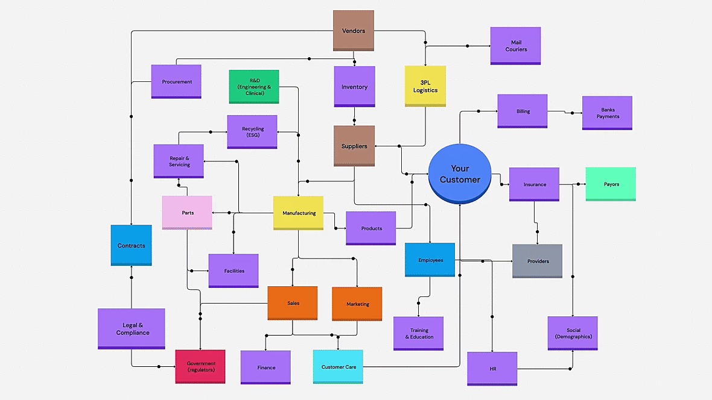

# FD Labs
Explore hands-on projects, experiments, and insights across data, development, and strategy.

## Enterprise AI Opportunity Map

AI only creates maximum value when it sees the **entire enterprise**. Agents in silos miss patterns, correlations, and opportunities that span departments and functions.

### Why a Holistic View Matters

Without a full-picture perspective, AI risks:

- **Duplicating efforts** across teams  
- **Missing cross-department insights**  
- **Making inconsistent decisions**  
- **Limiting scalability and impact**  

### Interconnected Use Cases

- **Customer Support + Product + Marketing** → Support tickets reveal product flaws; product teams fix issues; marketing adjusts campaigns, improving retention and acquisition.  
- **Supply Chain + Finance + Operations** → Demand forecasting informs inventory, cash flow planning, and production schedules, reducing costs and delays.  
- **HR + Operations + IT** → Workforce analytics guide hiring, scheduling, and system resource allocation, improving productivity enterprise-wide.  
- **Sales + Marketing + Customer Success** → AI predicts churn, aligns campaigns, and informs customer success interventions, boosting revenue and loyalty.  
- **R&D + Procurement + Manufacturing** → Material usage and test results inform procurement planning and production optimization.  
- **Risk + Legal + Compliance** → AI detects patterns in contracts, transactions, and policies, preventing violations and costly penalties.  
- **Finance + Legal + Strategy** → Revenue and expense forecasts feed scenario modeling, supporting mergers, acquisitions, or new market expansions.  
- **Operations + Sustainability + Marketing** → Energy consumption and waste data guide sustainability programs, which marketing communicates to improve brand perception.  

### Enterprise-Ready AI

Agents must understand:  

- **Cross-functional dependencies**  
- **Integrated data across all departments**  
- **End-to-end workflows**  
- **Scalable intelligence**  

By seeing the enterprise as a connected system, AI transforms from isolated tools into **strategic engines that drive measurable, organization-wide value**.

## ❄️ [Snowflake Labs](snowflake/index.md)
Practical guides, sample data models, and explorations of AI/ML capabilities in Snowflake.

## 🛠️ [Dev Tools Labs](dev-tools/index.md)
Workflows, productivity hacks, and toolkits for building smarter and faster.

## 💡 [Blog Labs](blog/index.md)
Perspectives on industry trends, business strategy, and the evolving tech landscape.

---

## Next Article

[:octicons-arrow-right-24: Snowflake Labs](snowflake/index.md){ .md-button .md-button--primary }

Dive into our comprehensive Snowflake learning lab, featuring data models, analytics guides, and AI/ML capabilities.
